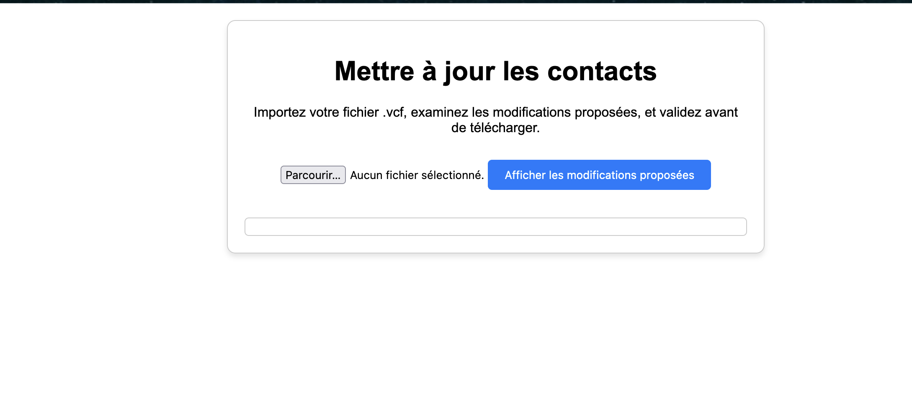
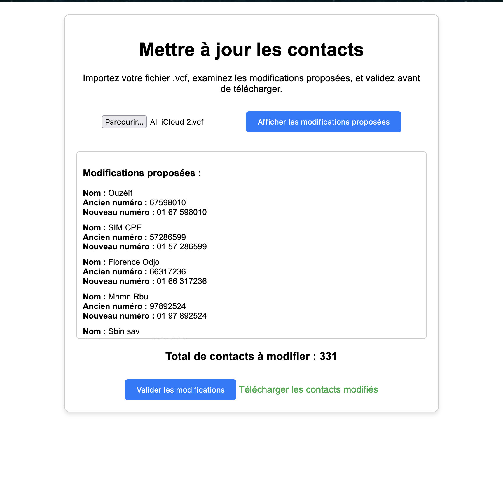

# Gestion et Mise à Jour des Contacts avec Préfixe `01`

Ce projet est une application web qui permet de mettre à jour vos contacts téléphoniques en ajoutant automatiquement le préfixe `01` pour les numéros de téléphone au format béninois. L'application utilise un fichier `.vcf` (vCard) pour l'importation et l'exportation des contacts, en fournissant une interface utilisateur pour visualiser les changements avant validation.

---

## Fonctionnalités

- **Importation de contacts au format `.vcf`** :
  - Permet de charger un fichier `.vcf` contenant vos contacts existants.

- **Analyse des numéros à modifier** :
  - Identifie les numéros valides nécessitant l'ajout du préfixe `01`.
  - Affiche une liste des contacts affectés avant d'appliquer les changements.
  - Affiche le nombre total de contacts modifiés.

- **Visualisation des modifications** :
  - Présente une vue avant/après des numéros :
    - Nom du contact.
    - Ancien numéro.
    - Nouveau numéro.

- **Validation stricte des numéros** :
  - Les numéros doivent contenir exactement **8 chiffres** après suppression des espaces.
  - Les numéros déjà conformes (`01` en préfixe) ne sont pas modifiés.
  - Les numéros incomplets ou mal formatés (ex. `99`) sont ignorés.

- **Exportation des contacts mis à jour** :
  - Génère un fichier `.vcf` contenant les modifications validées.

---

## Cas Pris en Charge

1. **Numéros au format standard** :
   - Exemple : `94612855` devient `01 94 61 2855`.

2. **Numéros avec espaces** :
   - Exemple : `94 61 2855` devient `01 94 61 2855`.

3. **Numéros déjà conformes** :
   - Exemple : `01 94 61 2855` reste inchangé.

4. **Numéros incomplets ou invalides** :
   - Exemple : `99` est ignoré.

5. **Numéros avec différents formats** :
   - Numéros courts ou avec des caractères non numériques sont exclus.

---

## Dépendances

- **Frontend** : Interface utilisateur développée en **HTML**, **CSS**, et **JavaScript**.
- **Backend** : Traitement des fichiers `.vcf` et logique d'analyse/modification des numéros.
- **Bibliothèques utilisées** :
  - [vCard Parser](https://www.npmjs.com/package/vcf-parser) pour lire et écrire des fichiers `.vcf`.

---

## Utilisation

### 1. Importation d'un fichier `.vcf`
1. Cliquez sur le bouton **Importer** et sélectionnez un fichier `.vcf`.
2. L'application analysera les numéros dans le fichier.

### 2. Visualisation des modifications
1. Une liste des contacts modifiés sera affichée avec :
   - Nom du contact.
   - Ancien numéro.
   - Nouveau numéro.

2. Les numéros invalides ou déjà conformes seront exclus de la liste.

### 3. Validation et exportation
1. Une fois les modifications validées, cliquez sur **Exporter**.
2. Le fichier `.vcf` mis à jour sera téléchargé.

---

## Captures d'Écran

### Interface Principale

### Aperçu des Modifications

---

## Améliorations Futures

- Gestion des formats internationaux.
- Prise en charge de formats non standards (ex. numéros avec tirets, parenthèses).
- Ajout de tests unitaires pour garantir la fiabilité des modifications.

---

## Auteurs

- **Développeur** : [Votre Nom ou Équipe]
- **Date** : Novembre 2024